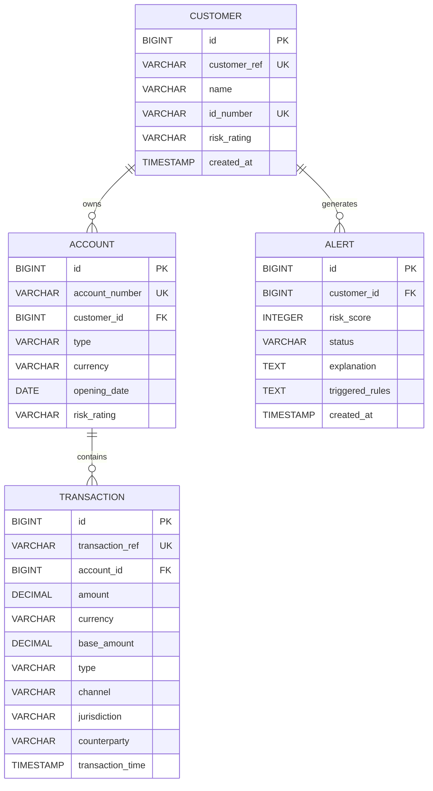

# Sentinel AML

Sentinel AML is a Spring Boot backend prototype for detecting suspicious financial transactions using configurable rule-based AML detection.

The system currently supports customer, account, transaction, and alert management, with a rule-based detection engine for identifying suspicious transactions.

## Tech Stack

* Java 21
* Spring Boot 4.1.1
* Spring Data JPA
* Hibernate
* PostgreSQL
* Maven
* Lombok

## Architecture

Sentinel follows a layered architecture with domain-based package organization.

```text
Client
  |
  v
Controller Layer
  |
  v
Service Layer
  |
  +--------------------+
  |                    |
  v                    v
Repository        Detection Engine
  |                    |
  v              Detection Rules
PostgreSQL              |
                         v
                       Alert
                         |
                         v
                   Alert Repository
                         |
                         v
                     PostgreSQL
```

### Request Flow

For a transaction:

```text
POST /api/v1/transactions
            |
            v
TransactionController
            |
            v
TransactionService
            |
            +----------------------+
            |                      |
            v                      v
TransactionRepository      DetectionEngine
            |                      |
            v                +-----+------+
       PostgreSQL            |            |
                            CTR       High-Risk
                             Rule       Rule
                              |            |
                              +-----+------+
                                    |
                                    v
                               RuleResult
                                    |
                                    v
                              AlertService
                                    |
                                    v
                              AlertRepository
                                    |
                                    v
                               PostgreSQL
```

## Domain Model

The current core domain consists of four entities:

* Customer
* Account
* Transaction
* Alert

### Customer

Represents a bank customer.

Important fields:

* `id` - Internal database identifier
* `customerRef` - Business identifier
* `name`
* `idNumber`
* `riskRating`
* `createdAt`

### Account

Represents a customer's bank account.

Important fields:

* `id` - Internal database identifier
* `accountNumber` - Business identifier
* `customer`
* `type`
* `currency`
* `openingDate`
* `riskRating`

### Transaction

Represents a financial transaction performed through an account.

Important fields:

* `id`
* `transactionRef`
* `account`
* `amount`
* `currency`
* `baseAmount`
* `type`
* `channel`
* `jurisdiction`
* `counterparty`
* `transactionTime`

### Alert

Represents a suspicious activity detected by the detection engine.

Important fields:

* `id`
* `customer`
* `riskScore`
* `status`
* `triggeredRules`
* `explanation`
* `createdAt`

## Entity Relationships

```text
Customer
   |
   | 1 : N
   |
   v
Account
   |
   | 1 : N
   |
   v
Transaction

Customer
   |
   | 1 : N
   |
   v
Alert
```

### Relationship Explanation

#### Customer → Account

One customer can have multiple accounts.

```text
Customer 1 -------- N Account
```

The `accounts.customer_id` column references `customers.id`.

#### Account → Transaction

One account can have multiple transactions.

```text
Account 1 -------- N Transaction
```

The `transactions.account_id` column references `accounts.id`.

#### Customer → Alert

One customer can have multiple alerts over time.

```text
Customer 1 -------- N Alert
```

The `alerts.customer_id` column references `customers.id`.

## Database Schema

### customers

| Column       | Type         | Constraints      |
| ------------ | ------------ | ---------------- |
| id           | BIGINT       | PK               |
| customer_ref | VARCHAR(50)  | NOT NULL, UNIQUE |
| name         | VARCHAR(150) | NOT NULL         |
| id_number    | VARCHAR(100) | NOT NULL, UNIQUE |
| risk_rating  | VARCHAR(20)  | NOT NULL         |
| created_at   | TIMESTAMP    | NOT NULL         |

### accounts

| Column         | Type        | Constraints       |
| -------------- | ----------- | ----------------- |
| id             | BIGINT      | PK                |
| account_number | VARCHAR(50) | NOT NULL, UNIQUE  |
| customer_id    | BIGINT      | FK → customers.id |
| type           | VARCHAR(30) | NOT NULL          |
| currency       | VARCHAR(10) | NOT NULL          |
| opening_date   | DATE        | NOT NULL          |
| risk_rating    | VARCHAR(20) | NOT NULL          |

### transactions

| Column           | Type          | Constraints      |
| ---------------- | ------------- | ---------------- |
| id               | BIGINT        | PK               |
| transaction_ref  | VARCHAR       | NOT NULL, UNIQUE |
| account_id       | BIGINT        | FK → accounts.id |
| amount           | NUMERIC(19,4) | NOT NULL         |
| currency         | VARCHAR(10)   | NOT NULL         |
| base_amount      | NUMERIC(19,4) | NOT NULL         |
| type             | VARCHAR(30)   | NOT NULL         |
| channel          | VARCHAR(30)   | NOT NULL         |
| jurisdiction     | VARCHAR(10)   | NOT NULL         |
| counterparty     | VARCHAR(100)  | NOT NULL         |
| transaction_time | TIMESTAMP     | NOT NULL         |

### alerts

| Column          | Type        | Constraints       |
| --------------- | ----------- | ----------------- |
| id              | BIGINT      | PK                |
| customer_id     | BIGINT      | FK → customers.id |
| risk_score      | INTEGER     | NOT NULL          |
| status          | VARCHAR(30) | NOT NULL          |
| explanation     | TEXT        |                   |
| triggered_rules | TEXT        |                   |
| created_at      | TIMESTAMP   | NOT NULL          |

## ERD



## Detection Engine

The detection engine uses a common `DetectionRule` interface.

```text
DetectionRule
      |
      +---- CtrRule
      |
      +---- HighRiskJurisdictionRule
      |
      +---- StructuringRule (planned)
      |
      +---- RapidMovementRule (planned)
      |
      +---- BehavioralDeviationRule (planned)
```

Each rule returns a `RuleResult` containing:

* Whether the rule triggered
* Rule name
* Risk score contribution
* Human-readable explanation

The detection engine collects all triggered rules and the alert service calculates the final risk score.

## Current Detection Rules

### CTR Threshold

A transaction with a base amount greater than or equal to `10,000` triggers the CTR threshold rule.

Current risk contribution:

```text
30
```

### High-Risk Jurisdiction

Transactions involving configured high-risk jurisdictions trigger an alert.

Current risk contribution:

```text
50
```

## Risk Scoring

Triggered rule scores are combined and capped at 100.

Example:

```text
CTR                  30
High-Risk            50
------------------------
Raw Score            80
Final Score          80
```

If the combined score exceeds 100:

```text
Final Score = 100
```

## API Endpoints

### Customer

```http
POST /api/v1/customers
GET  /api/v1/customers/{id}
```

### Account

```http
POST /api/v1/accounts
GET  /api/v1/accounts/{id}
```

### Transaction

```http
POST /api/v1/transactions
```

## Example: Create Customer

```http
POST /api/v1/customers
Content-Type: application/json
```

```json
{
  "customerRef": "CUS-10001",
  "name": "Test Customer",
  "idNumber": "SYNTH-10001",
  "riskRating": "MEDIUM"
}
```

## Example: Create Account

```http
POST /api/v1/accounts
Content-Type: application/json
```

```json
{
  "accountNumber": "ACC-10001",
  "customerId": 1,
  "type": "SAVINGS",
  "currency": "INR",
  "openingDate": "2025-01-10",
  "riskRating": "MEDIUM"
}
```

## Example: Create Transaction

```http
POST /api/v1/transactions
Content-Type: application/json
```

```json
{
  "transactionRef": "TX-10001",
  "accountId": 1,
  "amount": 15000,
  "currency": "INR",
  "type": "DEPOSIT",
  "channel": "ONLINE",
  "jurisdiction": "IN",
  "counterparty": "CP-001",
  "transactionTime": "2026-09-19T11:00:00"
}
```

Because the amount is greater than or equal to `10,000`, the CTR rule is triggered and an alert is generated.

## Configuration

PostgreSQL connection is configured through `application.properties`.

Sensitive credentials should be supplied through environment variables rather than committed to source control.

Example:

```properties
spring.datasource.url=jdbc:postgresql://localhost:5432/sentinel_aml
spring.datasource.username=postgres
spring.datasource.password=${DB_PASSWORD}
```

## Running the Application

### Prerequisites

* Java 21
* Maven
* PostgreSQL

### Create Database

```sql
CREATE DATABASE sentinel_aml;
```

### Configure Database Password

Windows PowerShell:

```powershell
$env:DB_PASSWORD="your_password"
```

### Run

```bash
mvn clean spring-boot:run
```

The application runs on:

```text
http://localhost:8080
```

## Project Structure

```text
com.harsh.azentio
│
├── customer
│   ├── controller
│   ├── dto
│   ├── entity
│   ├── repository
│   └── service
│
├── account
│   ├── controller
│   ├── dto
│   ├── entity
│   ├── repository
│   └── service
│
├── transaction
│   ├── controller
│   ├── dto
│   ├── entity
│   ├── repository
│   └── service
│
├── detection
│   ├── engine
│   ├── model
│   └── rule
│
├── alert
│   ├── entity
│   ├── repository
│   └── service
│
└── common
```

## Current Status

### Implemented

* [x] Spring Boot application
* [x] PostgreSQL integration
* [x] Customer entity and API
* [x] Account entity and API
* [x] Transaction entity and API
* [x] Customer → Account relationship
* [x] Account → Transaction relationship
* [x] Customer → Alert relationship
* [x] Transaction validation
* [x] CTR detection rule
* [x] High-risk jurisdiction detection rule
* [x] Detection engine
* [x] Risk scoring
* [x] Alert creation

### Planned

* [ ] Structuring detection
* [ ] Rapid movement detection
* [ ] Behavioral deviation detection
* [ ] Alert API
* [ ] Case management
* [ ] Analyst disposition
* [ ] Audit trail
* [ ] Rule configuration database
* [ ] Synthetic seed dataset
* [ ] Flyway migration scripts
* [ ] OpenAPI/Swagger documentation
* [ ] Unit tests
* [ ] Authentication and RBAC
* [ ] Kafka-based streaming ingestion
* [ ] Frontend dashboard
